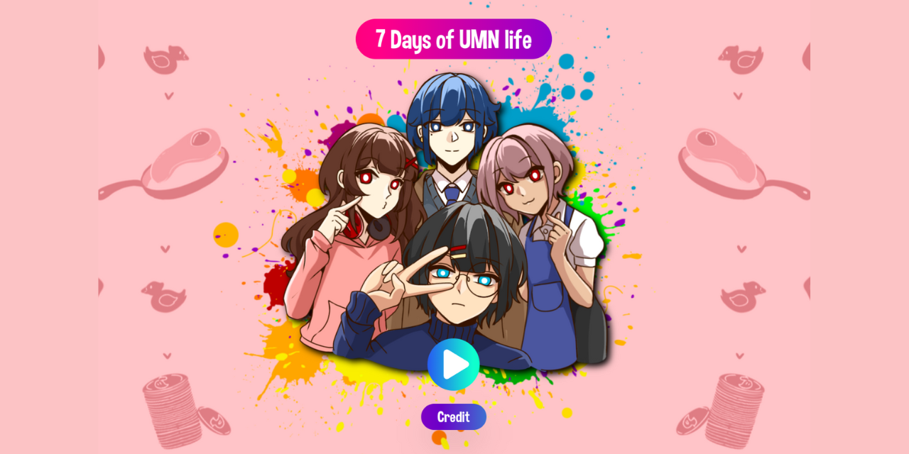
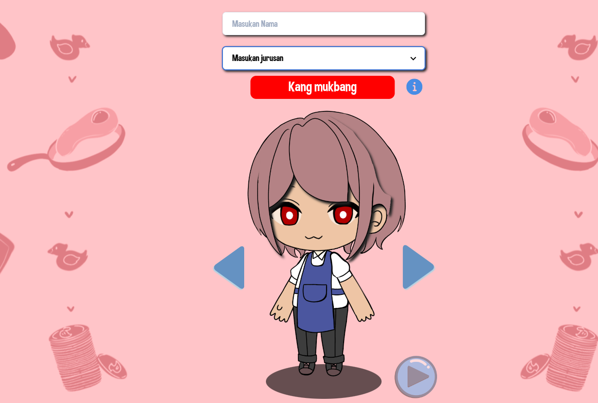
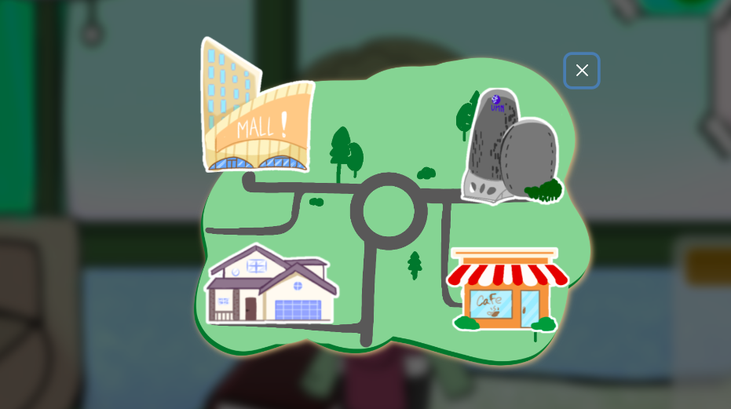
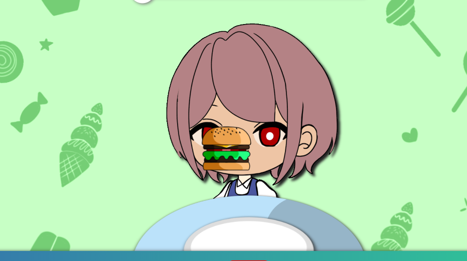
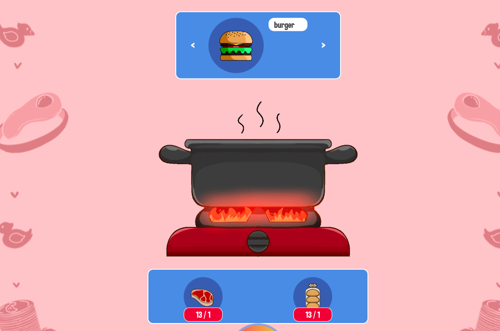
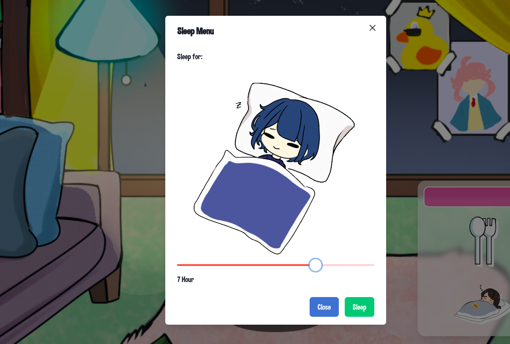
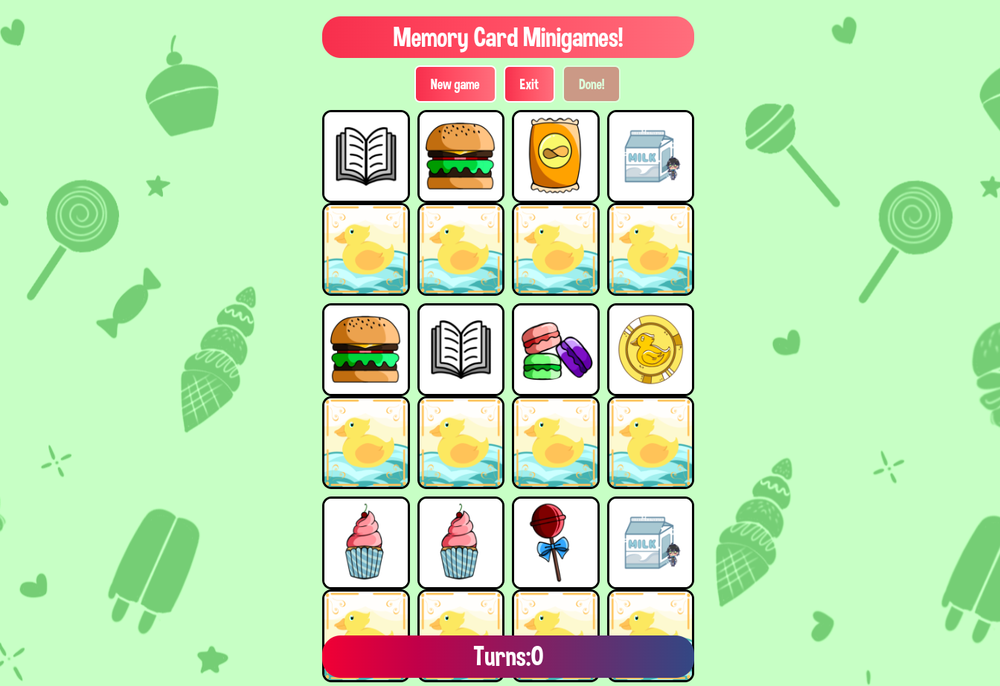
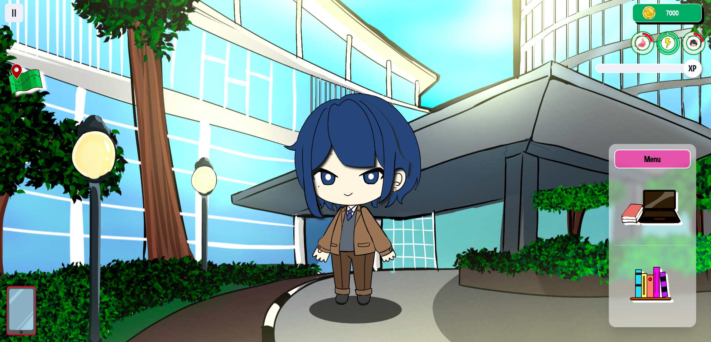
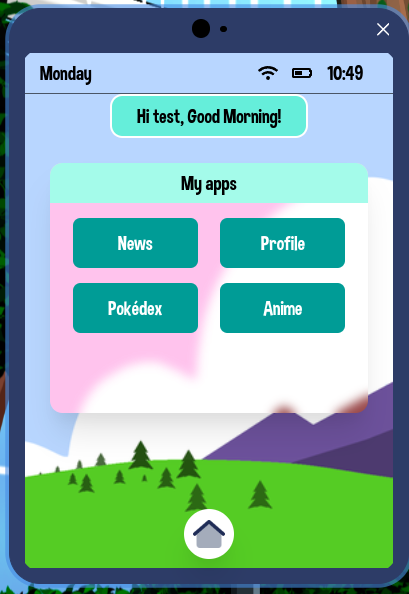
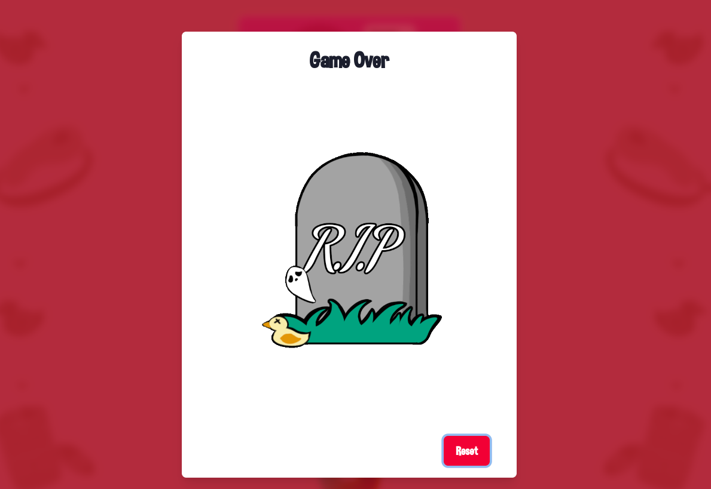

# UMN Sims | By Keluarga Bebek 👨‍🎓🎮

## Journal: [IJRR](https://ijrrjournal.com/IJRR_Vol.10_Issue.1_Jan2023/IJRR-Abstract76.html)

This project was developed by Keluarga Bebek as a final project for the course of Game Development and Design at the
University of Multimedia Nusantara. The game was developed using React & JavaScript programming
language. The game is a simulation game that tells the story of a student's life at the University of Multimedia
Nusantara. The game is designed to be played on a web browser.

## How To Play 🎮

- Press the play / start button
- Before starting the game, choose a character, write the player's name, and choose a major.
  
- The player will be taken to the home as the starting point
- On the left side of the home page, there are 3 buttons: pause, map, and phone, which will also appear on the
  university,
  cafe, and mall pages.
- On the top right, there is a status of the number of coins, below it there are 3 main statuses (hunger, energy,
  happiness), and below the 3 statuses, there is an XP bar.
- The percentage of this status can decrease over time
- If one of the percentages reaches 0, then the game is over and the player can reset the game.
- At home, there are 4 main buttons: eat, sleep, play, and cook
- At the mall, there are 2 main buttons: Shopping, and part-time cashier
- At the cafe, there are 2 main buttons: coffee, and part-time cashier
- At the university, there are 2 main buttons: class, and library
- All backgrounds in each place will change according to the weather and time of day
- To win, the player must survive for at least 7 days to get a review of their life as a UMN student for the last 7
  days

___

# MAIN FEATURES 🎮

## [MAP]

Inside the map, the player can move to different places as desired at certain times

1. HOME [open all time]
    - EAT :
      
        - At the start of the game, the inventory will be filled with several types of food with limited stock.
        - The eating system itself uses a drag & drop system and later each type of food will have a different level of
          filling
          the stomach. So the increase in status bar will also depend on the food chosen.
    - COOK :
      
        - This feature will complete the food supply in the inventory to be eaten.
        - To start cooking, all ingredients must be available first. These food ingredients can be purchased at the
          supermarket.
    - SLEEP :
      
        - The sleep menu functions to increase the energy status of the character, where there is a slider to determine
          the duration of sleep and the clock will pass as well.
    - PLAY :
      
        - As an addition, this play menu is in the form of a memory card minigame, where from playing, the character can
          increase the happiness status and also add money.

2. MALL / SUPERMARKET [open from 7 am to 11 pm]
    - SHOPPING
      In this menu, the character can shop for some necessities which can later be used for cooking food.
      Because basically shopping, money will also be reduced if the character buys something
    - PART-TIME CASHIER
      Here, the character is allowed to work part-time as a cashier at the supermarket which can add money, but can also
      reduce other stats.

3. CAFE [open from 7 am to 11 pm]

    - COFFEE
      In this menu, the character can increase all existing stats, but the money they have will be reduced to buy
      drinks.
    - PART-TIME CASHIER
      As a student, the character can also work part-time as a cashier at the cafe, so money can also be obtained from
      the results of work.

4. UNIVERSITY [open from 8 am to 5 pm]
   
    - STUDY
        - The character can add main XP (study) if they study.
        - Each department has different course choices depending on the player's choice at the beginning.
    - READ BOOKS
        - This menu is located in the library, where the character can also increase study stats by reading books
    - PART-TIME LIBRARIAN
        - This menu is also located in the library, where the character is allowed to get extra money from being a
          part-time librarian.

___ 

### PHONE

- The phone is a fairly powerful menu in this game, where there are various features and important information.
- There are various applications in the phone, for example news applications, player information (name, major, level,
  and
  playing time), pokedex, and anime list.
- In the phone, players can also see information about time and weather.

___ 

### PAUSE

- In the upper left, there is a pause button
- The menu displays sound settings that can be muted/unmuted.
- The menu also displays a reset button, which when pressed will bring up a confirmation pop-up to reset the game

___

### TIME

- 1 minute in the game = 1 second (real-life)

--- 

- There is a credit menu to see members
- All existing animations will follow the user's chosen character
- Each character has their own backstory and abilities which can affect their status bar
- Every day there will be a little extra pocket money from their parents

### Game Over

- If one of the status bars reaches 0, the game will be over and the player can reset the game
  